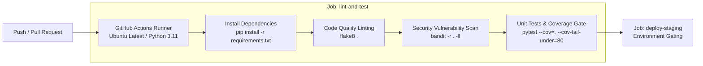

# Automated Python CI Pipeline with Bandit SAST

<p align="center">
  
  
  
  
  
</p>

---

## 📌 Project Overview

This repository demonstrates an automated **Continuous Integration (CI) and DevSecOps quality gate** built with **GitHub Actions** for Python applications. 

Every commit and pull request against the `main` branch undergoes automated linting, static application security testing (SAST), and unit testing with a mandatory code coverage enforcement threshold before promoting to staging.

---

## 🔄 CI Pipeline Architecture



---

## 🛡️ Quality & Security Gates Enforced

| Tool | Pipeline Stage | Security / Engineering Benefit |
|---|---|---|
| **Flake8** | Linting & Formatting | Enforces PEP 8 adherence, clean syntax, and prevents unhandled imports or undefined variables. |
| **Bandit** | Static Analysis (SAST) | Scans for Python security vulnerabilities (insecure cryptographic hashes, shell injection risks, hardcoded passwords, unsafe deserialization). Flags medium and high severity risks (`-ll`). |
| **Pytest & Coverage** | Test & Code Coverage | Executes unit test suites and enforces a **minimum 80% coverage threshold** (`--cov-fail-under=80`). Fails the build if tests do not sufficiently cover new changes. |
| **Environment Gating** | Staging Promotion | The `deploy-staging` job strictly depends on `lint-and-test` passing cleanly, preventing broken builds from reaching deployment. |

---

## 📂 Repository Layout

```text
.
├── .github/
│   └── workflows/
│       └── ci.yml             # Declarative GitHub Actions CI pipeline
├── app.py                     # Application logic
├── test_app.py                # Unit test specifications
└── requirements.txt           # Python application & testing dependencies
```

---

## 🚀 Running Quality Checks Locally

```bash
# 1. Install dependencies
pip install -r requirements.txt

# 2. Run static code style linter
flake8 .

# 3. Execute Bandit security scanner
bandit -r . -ll

# 4. Run tests with coverage threshold
pytest --cov=. --cov-fail-under=80
```
